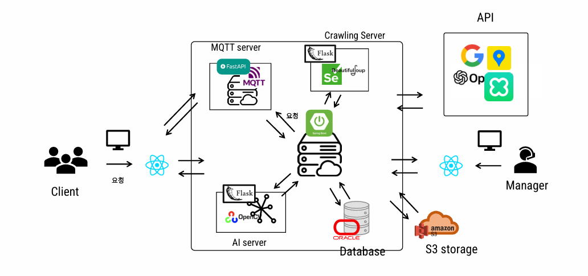

# TravleJoy Rest-API Server (Spring Boot)
: react를 통해 구축한 front를 받아 연결가능

### 서비스 아키텍처

- application.yml파일 설정 필요!
- jpa 사용
- java mail 사용
- 카카오/구글/네이버 소셜 로그인 사용
- aws s3를 이용한 이미지 저장
- naver clova를 이용한 stt/tts (tts는 비용문제로 이용불가)

### application.yml 파일:
- src/main/resources/application.yml는 보안상 제외하여 올림
- 내용 : server 기본정보, jwt, spring 기본정보 등
`
server:
  port: 8080
  tomcat:
    max-http-form-post-size: 52428800
      
jwt:
  secret: key
spring:
  datasource:
    driver-class-name: oracle.jdbc.OracleDriver
    url: database 주소
    username: db 유저이름
    password: db 비밀번호
	hikari:
      auto-commit: true # default(false)
      connection-timeout: 30000 # default(30000)
      maximum-pool-size: 50 # default(10)

  jpa:
    hibernate:
      ddl-auto: update
	  naming:
        physical-strategy: org.hibernate.boot.model.naming.CamelCaseToUnderscoresNamingStrategy
    properties:
      hibernate:
        format_sql: true
    show-sql: true
    
  mail:
    host: 
    port: 
    username:   #이메일
    password:  #발급받은 비밀번호
    properties:
      mail:
        smtp:
          auth: true
          starttls:
            enable: true
            required: true
          connectiontimeout: 5000
          timeout: 5000
          writetimeout: 5000
      auth-code-expiration-millis: 1800000 

logging:
  level:
    org:
      springframework:
        security: DEBUG

        
kakao:
  clientId: key
  redirectUri: http://localhost:8080/kakao
google:
  clientId: key
  clientSecret: key
  redirectUri: http://localhost:8080/google
naver:
  clientId: key
  clientSecret: key
  redirectUri: http://localhost:8080/naver
cloud:
  aws:
    credentials:
      access-key: key
      secret-key: key
    region:
      static: ap-northeast-2
    stack:
      auto: false
    s3:
      bucket: traveljoy-bucket-1
      
stt-api-key:
  clientId: key
  clientSecret: key
`